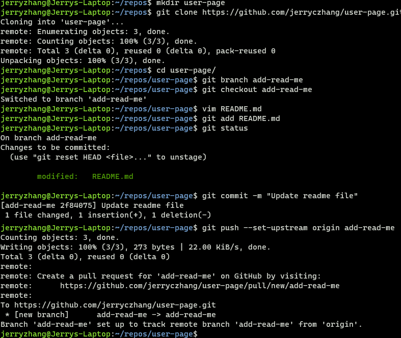
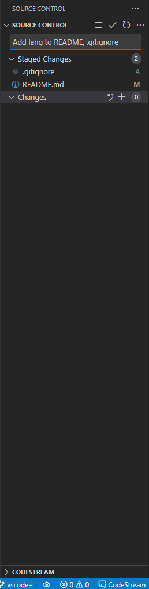

# Jerry Zhang
## My Interests/Activites
1. ML Projects
2. Piano
3. **Thomism**
4. ~~Videogames~~
### Favorite quote:
From G.K. Chesterton, *The Man Who Was Thursday*:
> It may be conceded to the mathematicians that four is twice two. But two is not twice one; two is two thousand times one.
### Favorite import statements:
```python
import tensorflow as plt
import pandas as tf
import numpy as pd
import matplotlib.pyplot as np
```
### Favorite website:
[Breadfish](https://www.breadfish.co.uk/home)

## Links
### Git screenshots:
- [Command line](screenshots/git_cmd.png)
- [VSCode](screenshots/git_vscode.png)
### (Pictures)


### Other:
[My favorite imports (again)](https://jerryczhang.github.io/user-page/#favorite-import-statements)

## To-do:
- [x] Headings
- [x] Styling text
- [x] Quoting text
- [x] Quoting Code
- [x] External Links
- [x] Section Links
- [x] Relative Links
- [x] Ordered and Unordered Lists
- [x] Task List